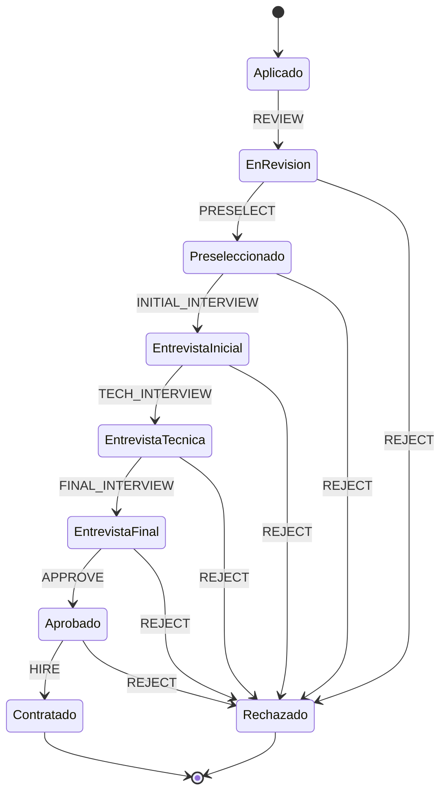

# Sistema de Recursos Humanos ISO-715

Un sistema completo de gestión de recursos humanos desarrollado con tecnologías web modernas, diseñado para automatizar el proceso de reclutamiento, selección y gestión de personal.

**Desarrollado por:** José Rodríguez  
**Matrícula:** A00064713  
**Institución:** Universidad APEC  
**Proyecto:** Sistema de RRHH con tecnologías Full-Stack

## 🚀 Características Principales

### ✅ Gestión Completa de Entidades
- **👥 Candidatos**: Registro, seguimiento de estado y evaluación completa
- **🏢 Empleados**: Gestión de personal activo con historial completo
- **💼 Puestos de Trabajo**: Definición de posiciones con rangos salariales (30,000-500,000 pesos)
- **🎯 Competencias**: Gestión de competencias técnicas, blandas y gerenciales
- **🌍 Idiomas**: Control de idiomas requeridos para posiciones
- **📚 Capacitaciones**: Seguimiento de certificaciones y entrenamientos
- **💼 Experiencia Laboral**: Historial profesional detallado

### ✅ Proceso de Selección Automatizado
**Máquina de Estados** implementada con XState para el flujo completo:
```
Aplicado → En Revisión → Preseleccionado → Entrevista Inicial 
→ Entrevista Técnica → Entrevista Final → Aprobado → Contratado
```
- Estados de rechazo disponibles en cualquier etapa
- Registro de observaciones con timestamps
- Transiciones validadas automáticamente

### ✅ Búsqueda Inteligente de Candidatos
- **Filtros múltiples**: Competencias, idiomas, capacitaciones
- **Experiencia mínima**: Filtrado por años de experiencia
- **Búsqueda semántica**: Por nombre, email, habilidades
- **Scoring automático**: Evaluación de compatibilidad con puestos

### ✅ Sistema de Reportes
- **📊 Reporte de Nuevos Empleados**: Análisis por rango de fechas (PDF)
- **📈 Resumen de Candidatos**: Estadísticas por estado del proceso (PDF)
- **💰 Análisis Salarial**: Inversión total y promedios salariales
- **📋 Reportes Personalizables**: Generación con plantillas Handlebars

### ✅ Autenticación y Seguridad
- **🔐 JWT Authentication**: Tokens seguros con expiración configurable
- **👤 Control de Roles**: Admin, HR Manager, Recruiter con permisos granulares
- **🛡️ Middleware de Autorización**: Protección de endpoints por roles
- **🔒 Sesiones Seguras**: Gestión de sesiones con Express-session

## 🏗️ Arquitectura del Sistema

### Patrón Arquitectónico
```
┌─────────────────┐    ┌─────────────────┐    ┌─────────────────┐
│   Frontend      │    │    Backend      │    │   Database      │
│   (React/TS)    │◄──►│  (Express.js)   │◄──►│  (PostgreSQL)   │
│                 │    │                 │    │                 │
│ • React Query   │    │ • Controllers   │    │ • Sequelize ORM │
│ • Tailwind CSS  │    │ • Services      │    │ • Migrations    │
│ • Zod Validation│    │ • Middleware    │    │ • Relationships │
└─────────────────┘    └─────────────────┘    └─────────────────┘
```

### Capas de la Aplicación
1. **📱 Presentation Layer (Frontend)**
   - React 19 con TypeScript
   - Tailwind CSS para estilos
   - React Query para estado global
   - React Router para navegación

2. **🔧 API Layer (Controllers)**
   - Express.js RESTful API
   - Validación con Joi
   - Autenticación JWT
   - Control de acceso RBAC

3. **💼 Business Logic Layer (Services)**
   - CandidateStateMachine (XState)
   - ReportService (JSReport/Puppeteer)
   - EmailService (pendiente)
   - NotificationService (pendiente)

4. **📊 Data Access Layer (Models/Repository)**
   - Sequelize ORM
   - PostgreSQL
   - Relaciones many-to-many
   - Migraciones automáticas

## 🛠️ Stack Tecnológico

### Backend
```json
{
  "runtime": "Node.js 16+",
  "framework": "Express.js 4.19",
  "database": "PostgreSQL 12+",
  "orm": "Sequelize 6.37",
  "authentication": "JWT + Passport.js",
  "validation": "Joi 17.12",
  "state_management": "XState 4.38",
  "reports": "Puppeteer 22.8 + Handlebars 4.7",
  "testing": "Jest 29.7 + Supertest 7.0"
}
```

### Frontend
```json
{
  "framework": "React 19.1",
  "language": "TypeScript 5.8",
  "bundler": "Vite 6.3",
  "styling": "Tailwind CSS 3.4",
  "state": "TanStack React Query 5.80",
  "forms": "React Hook Form 7.57",
  "validation": "Zod 3.25",
  "icons": "Lucide React 0.513",
  "notifications": "React Hot Toast 2.5"
}
```

### DevOps & Tools
```json
{
  "version_control": "Git",
  "package_manager": "npm",
  "development": "Nodemon",
  "linting": "ESLint",
  "cors": "CORS 2.8",
  "environment": "dotenv 16.4"
}
```

## 📋 Modelo de Datos

### Entidades Principales
```sql
-- Candidatos: Información personal y profesional
Candidatos (id, nombres, apellidos, email, telefono, documento_identidad, 
           fecha_nacimiento, direccion, estado, fecha_aplicacion, 
           salario_aspirado, disponibilidad, observaciones)

-- Empleados: Personal activo de la empresa
Empleados (id, candidatoId, puestoId, codigo_empleado, fecha_ingreso, 
          salario_acordado, tipo_contrato, estado)

-- Puestos: Posiciones laborales disponibles
Puestos (id, nombre, descripcion, departamento, nivel_riesgo, 
        salario_minimo, salario_maximo, estado)

-- Competencias: Habilidades técnicas y blandas
Competencias (id, nombre, descripcion, tipo, estado)

-- Idiomas: Idiomas requeridos para posiciones
Idiomas (id, nombre, codigo_iso, estado)

-- Capacitaciones: Cursos y certificaciones
Capacitaciones (id, nombre, descripcion, institucion, tipo, 
               duracion_horas, fecha_inicio, fecha_fin, activa)

-- Experiencia Laboral: Historial profesional
ExperienciaLaboral (id, candidatoId, empresa, puesto, descripcion,
                   fecha_inicio, fecha_fin, trabajo_actual, salario)
```

### Relaciones
```sql
-- Many-to-Many
Candidatos ↔ Competencias (CandidatoCompetencias)
Candidatos ↔ Idiomas (CandidatoIdiomas)
Candidatos ↔ Capacitaciones (CandidatoCapacitaciones)
Puestos ↔ Competencias (PuestoCompetencias)
Puestos ↔ Idiomas (PuestoIdiomas)

-- One-to-Many
Candidatos → ExperienciaLaboral
Puestos → Empleados

-- One-to-One
Candidatos → Empleados
```

## 🚀 Instalación y Configuración

### Prerrequisitos
- **Node.js** >= 16.x
- **PostgreSQL** >= 12.x
- **npm** o **yarn**
- **Git**

### 1. Clonar y Configurar
```bash
# Clonar repositorio
git clone <repository-url>
cd RRHH-ISO715

# Instalar dependencias del backend
npm install

# Instalar dependencias del frontend
cd frontend
npm install
cd ..
```

### 2. Configuración de Base de Datos
```bash
# Crear base de datos
createdb rrhh_system

# Copiar archivo de configuración
cp env-example.txt .env
```

### 3. Variables de Entorno (.env)
```env
# Servidor
NODE_ENV=development
PORT=3001

# Base de Datos
DB_HOST=localhost
DB_PORT=5432
DB_NAME=rrhh_system
DB_USER=postgres
DB_PASSWORD=tu_password

# Autenticación
JWT_SECRET=tu_jwt_secret_super_seguro_aqui
JWT_EXPIRES_IN=24h

# Sesiones
SESSION_SECRET=tu_session_secret_aqui

# Reportes
JSREPORT_CHROME_LAUNCHARGS=--no-sandbox
```

### 4. Inicialización
```bash
# Crear estructura de base de datos
npm run setup-db

# Poblar con datos de ejemplo
npm run seed

# Iniciar servidor de desarrollo (backend)
npm run dev

# En otra terminal, iniciar frontend
cd frontend
npm run dev
```

## 📁 Estructura del Proyecto

```
RRHH-ISO715/
├── 📁 backend/
│   ├── 📁 config/
│   │   └── 📄 database.js           # Configuración Sequelize
│   ├── 📁 controllers/              # Controladores de API
│   │   ├── 📄 AuthController.js
│   │   ├── 📄 CandidatoController.js
│   │   ├── 📄 CompetenciaController.js
│   │   ├── 📄 IdiomaController.js
│   │   ├── 📄 CapacitacionController.js
│   │   ├── 📄 PuestoController.js
│   │   ├── 📄 EmpleadoController.js
│   │   └── 📄 ReportController.js
│   ├── 📁 middleware/
│   │   └── 📄 auth.js               # Autenticación y autorización
│   ├── 📁 models/                   # Modelos Sequelize
│   │   ├── 📄 index.js              # Relaciones de modelos
│   │   ├── 📄 User.js
│   │   ├── 📄 Candidato.js
│   │   ├── 📄 Empleado.js
│   │   ├── 📄 Puesto.js
│   │   ├── 📄 Competencia.js
│   │   ├── 📄 Idioma.js
│   │   ├── 📄 Capacitacion.js
│   │   ├── 📄 ExperienciaLaboral.js
│   │   └── 📄 Departamento.js
│   ├── 📁 routes/                   # Rutas Express
│   │   ├── 📄 auth.js
│   │   ├── 📄 candidatos.js
│   │   ├── 📄 empleados.js
│   │   ├── 📄 puestos.js
│   │   ├── 📄 competencias.js
│   │   ├── 📄 idiomas.js
│   │   ├── 📄 capacitaciones.js
│   │   └── 📄 reports.js
│   ├── 📁 services/                 # Lógica de negocio
│   │   ├── 📄 CandidateStateMachine.js
│   │   └── 📄 ReportService.js
│   ├── 📁 scripts/                  # Scripts de utilidad
│   │   ├── 📄 seed.js               # Datos de ejemplo
│   │   ├── 📄 create-database.js
│   │   └── 📄 setup-database.js
│   └── 📄 server.js                 # Servidor principal
├── 📁 frontend/
│   ├── 📁 src/
│   │   ├── 📁 components/           # Componentes React
│   │   │   ├── 📄 CandidatosList.tsx
│   │   │   ├── 📄 CandidatoForm.tsx
│   │   │   ├── 📄 CandidatoDetail.tsx
│   │   │   ├── 📄 EmpleadosList.tsx
│   │   │   ├── 📄 PuestosList.tsx
│   │   │   ├── 📄 CompetenciasList.tsx
│   │   │   ├── 📄 ReporteNuevosEmpleados.tsx
│   │   │   └── 📄 Layout.tsx
│   │   ├── 📁 services/             # APIs y servicios
│   │   │   └── 📄 api.ts
│   │   ├── 📁 types/                # Tipos TypeScript
│   │   │   └── 📄 index.ts
│   │   ├── 📁 hooks/                # Custom hooks
│   │   ├── 📁 utils/                # Utilidades
│   │   ├── 📄 App.tsx
│   │   └── 📄 main.tsx
│   ├── 📄 package.json
│   ├── 📄 tailwind.config.js
│   ├── 📄 vite.config.ts
│   └── 📄 tsconfig.json
├── 📄 package.json
├── 📄 .env                          # Variables de entorno
├── 📄 .gitignore
└── 📄 README.md
```

## 🔌 API Documentation

### Autenticación
```http
POST   /api/auth/register     # Registrar usuario
POST   /api/auth/login        # Iniciar sesión
GET    /api/auth/profile      # Perfil usuario (auth requerida)
POST   /api/auth/logout       # Cerrar sesión
```

### Candidatos
```http
GET    /api/candidatos                    # Listar (paginado, filtros)
GET    /api/candidatos/search             # Búsqueda avanzada
GET    /api/candidatos/:id                # Obtener por ID
POST   /api/candidatos                    # Crear candidato
PUT    /api/candidatos/:id                # Actualizar candidato
DELETE /api/candidatos/:id                # Eliminar (HR Manager+)
POST   /api/candidatos/:id/change-state   # Cambiar estado
```

### Empleados
```http
GET    /api/empleados         # Listar empleados
GET    /api/empleados/:id     # Obtener empleado
POST   /api/empleados         # Contratar candidato
PUT    /api/empleados/:id     # Actualizar empleado
DELETE /api/empleados/:id     # Dar de baja (Admin)
```

### Configuración
```http
# Competencias
GET/POST/PUT/DELETE  /api/competencias[/:id]

# Idiomas  
GET/POST/PUT/DELETE  /api/idiomas[/:id]

# Capacitaciones
GET/POST/PUT/DELETE  /api/capacitaciones[/:id]

# Puestos
GET/POST/PUT/DELETE  /api/puestos[/:id]
```

### Reportes
```http
GET /api/reports/new-employees        # Nuevos empleados (PDF)
GET /api/reports/candidates-summary   # Resumen candidatos (PDF)
```

## 🔐 Sistema de Roles y Permisos

| Rol | Permisos |
|-----|----------|
| **👤 Recruiter** | • Ver/crear/editar candidatos<br>• Cambiar estados de candidatos<br>• Buscar candidatos<br>• Ver reportes básicos |
| **👥 HR Manager** | • Todo lo de Recruiter<br>• Eliminar candidatos<br>• Contratar empleados<br>• Generar todos los reportes<br>• Gestionar configuraciones |
| **⚡ Admin** | • Acceso completo al sistema<br>• Gestión de usuarios<br>• Configuración de roles<br>• Respaldos y mantenimiento |

## 📊 Estados del Candidato



## 🧪 Testing

```bash
# Ejecutar tests del backend
npm test

# Ejecutar tests con cobertura
npm run test:coverage

# Tests del frontend
cd frontend
npm test
```

## 📈 Scripts Disponibles

### Backend
```bash
npm start              # Producción
npm run dev            # Desarrollo con nodemon
npm test              # Tests con Jest
npm run seed          # Poblar base de datos
npm run create-db     # Crear base de datos
npm run setup-db      # Configurar esquema
```

### Frontend
```bash
npm run dev           # Servidor de desarrollo
npm run build         # Build para producción
npm run preview       # Vista previa del build
npm run lint          # Linting con ESLint
```

## 🚀 Deployment

### Variables de Producción
```env
NODE_ENV=production
PORT=3001
DB_SSL=true
JWT_SECRET=super_secure_production_secret
SESSION_SECRET=production_session_secret
```

### Docker (Opcional)
```dockerfile
# Dockerfile ejemplo
FROM node:16-alpine
WORKDIR /app
COPY package*.json ./
RUN npm ci --only=production
COPY . .
EXPOSE 3001
CMD ["npm", "start"]
```

## 🤝 Contribución

1. **Fork** el proyecto
2. Crear rama feature: `git checkout -b feature/nueva-funcionalidad`
3. **Commit** cambios: `git commit -am 'feat: (TICKET-123) Nueva funcionalidad'`
4. **Push** a la rama: `git push origin feature/nueva-funcionalidad`
5. Crear **Pull Request**

### Formato de Commits
```
<tipo>: (TICKET-NUMERO) Descripción corta

Tipos: feat, fix, docs, style, refactor, test, chore
Ejemplo: feat: (RRHH-456) Agregar filtro por experiencia laboral
```

## 📚 Recursos Adicionales

- [Express.js Documentation](https://expressjs.com/)
- [Sequelize ORM Guide](https://sequelize.org/docs/)
- [React Documentation](https://react.dev/)
- [Tailwind CSS](https://tailwindcss.com/)
- [XState Documentation](https://xstate.js.org/)

## 📞 Soporte

- **Issues**: Reportar bugs en GitHub Issues
- **Features**: Solicitudes de funcionalidad vía Issues  
- **Documentación**: Wiki del proyecto
- **FAQ**: Preguntas frecuentes en Discussions

## 👨‍💻 Desarrollador

**José Rodríguez**  
**Matrícula:** A00064713

Este sistema fue desarrollado como parte del proyecto académico para la gestión moderna de recursos humanos, implementando las mejores prácticas de desarrollo web full-stack con Node.js, React y PostgreSQL.

## 📄 Licencia

ISC License - Ver archivo LICENSE para más detalles.

---

**Desarrollado con ❤️ para la gestión moderna de recursos humanos**  
*José Rodríguez - A00064713*